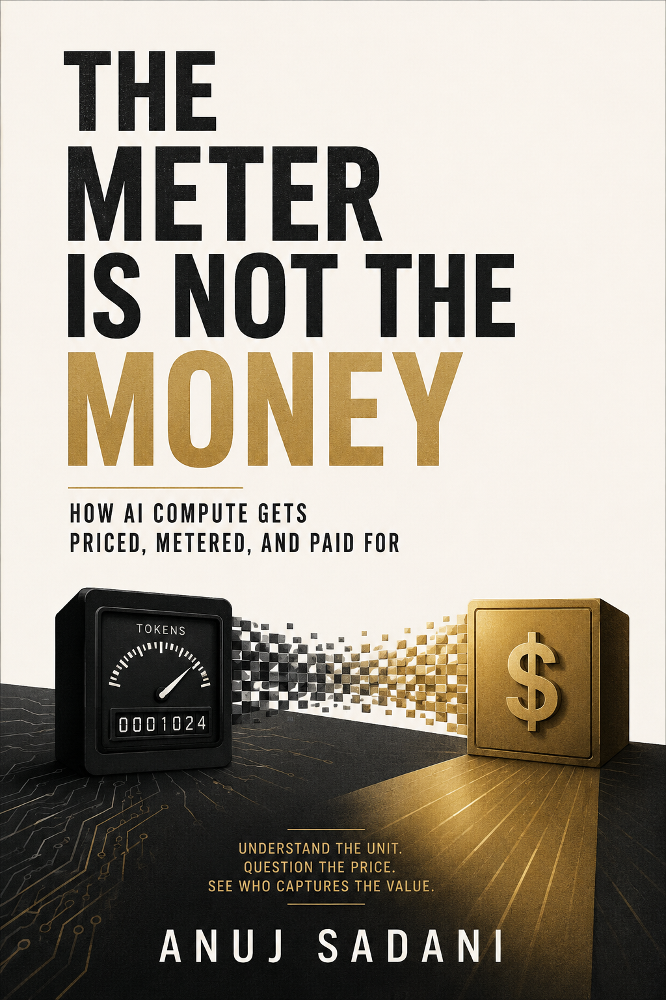

# The Meter Is Not the Money

<p align="center">
  
</p>

<p align="center">
  <strong><a href="https://tech.anujsadani.in/the-meter-is-not-the-money/">Read online</a></strong>
  &nbsp;&middot;&nbsp;
  <strong><a href="https://ko-fi.com/s/0f1f4f72ad">Get the typeset PDF on Ko-fi</a></strong>
  &nbsp;&middot;&nbsp;
  <a href="SUMMARY.md">The argument in five minutes</a>
</p>

---

In August 2026 a payments company agreed to buy a router for a price it never
disclosed. Its chief executive explained the purchase by calling tokens the
central currency of companies building with AI.

He was half right, and the wrong half is the interesting one. Every credit
balance in this market — including the one belonging to the company that was
bought — is denominated in dollars, because a token's price is not fixed when
you buy it, varies by a factor of three between suppliers of an identical
product, and moves in opposite directions depending on which vendor served the
request.

**A token is a meter reading, not a unit of account.** Every AI credit that
ships is a per-model conversion layer over dollars, which is why the position
worth owning is the exchange desk rather than the mint.

Thirty pages, six sections. Built with [book-forge](../book-forge), theme
`sheet-oxblood`.

## Layout

```
meta.yaml          book-forge configuration
book.html.in       the manuscript, hand-authored HTML
SUMMARY.md         the condensed argument, in five minutes
summary/           the same, as a standalone page
assets/            cover art
research/          the verified source ledger this book is built on
index.html         built — screen edition
```

The typeset PDF is built locally and sold on Ko-fi; `*.pdf` is gitignored, so
it is not distributed from this repository.

## Build

```bash
PYTHONPATH=../book-forge python -m bookforge build
```

`doctor` checks the environment; `verify` audits an already-built PDF; `inject`
re-renders the front-matter and about partials into `book.html.in` after a
`meta.yaml` change. (`bf` is not on PATH here, hence `python -m`.)

**Run `inject` before `build` whenever the matter config in `meta.yaml` changes.**
The QR slots live inside the injected partials, so a build without injection
fails verification on stale QR codes and missing matter probes.

## Sourcing

Every `c-0NN` superscript in the text resolves to a row in
`research/claims.jsonl`. That workspace was produced by the `research-anything`
pipeline: each claim bound to a quoted passage inside a stored snapshot of its
source, with the snapshot's SHA-256 recorded, machine-checked before the sentence
citing it was written.

- **38 sources**, 17 of them T1 — price pages, terms of service, vendor
  documentation, and a federal rulemaking.
- **77 claims**, all `verified: pass`. 83 citations across 74 distinct claims;
  every one resolves and none is marked failed.
- **4 contested claims** (`c-007`, `c-051`, `c-052`, `c-069`) are each presented
  as contested in the text rather than resolved silently.

Two rules follow and should not be relaxed:

1. **Do not cite a claim that is not in the ledger.** If a sentence needs a
   source that is not there, run the research first. Two quotations reached a
   late draft unbound and were bound before publication rather than cut.
2. **Do not soften Section 5.** It carries the strongest case against the book's
   own thesis, and the front matter promises the reader it stands unanswered.

## Known limits

Each is disclosed in the section that depends on it, not only here.

| Section | Limit |
|---|---|
| 2 | All four reported prices reach the book secondhand — the primary reporting is paywalled |
| 3 | Mechanism is documented; the *magnitude* of price variance in production is unmeasured |
| 4 | Five pricing models is not a market survey |
| 6 | State money-transmitter licensing, CFPB Reg E, CARD Act and non-US regimes unresearched |
| 6 | Float, breakage and revenue recognition for prepaid balances unresearched |

## Notes

Two working files sit in the local directory and are deliberately not tracked.
`deep-research-report.md` is a generic research-methodology document that
predates this book and has nothing to do with routing. `AI Routing Ecosystem
Analysis.docx` is registered in the ledger as `s-027` at tier T4 with its
provenance flagged — no named author, and its footnote markers resolve to
nothing — so no claim rests on it; its extracted text ships as
`research/snapshots/s-027.txt`, which is what the audit trail needs.
